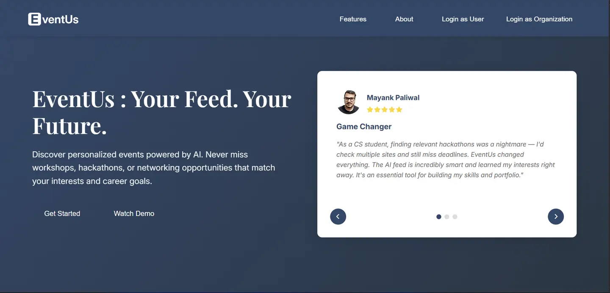
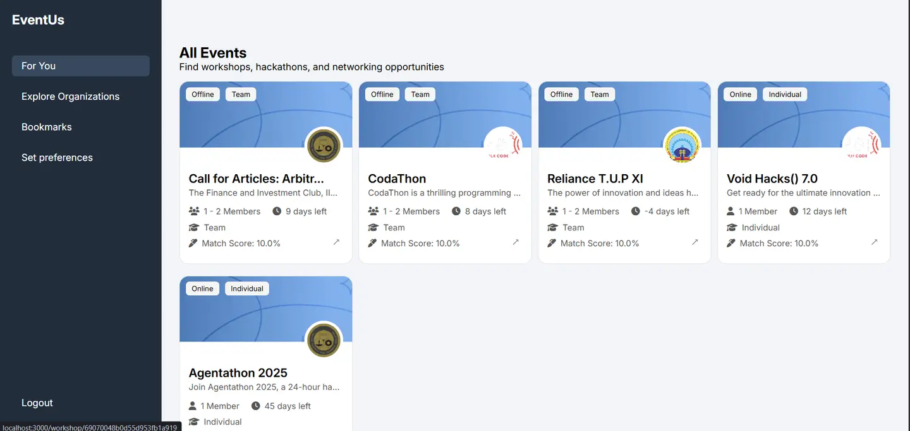
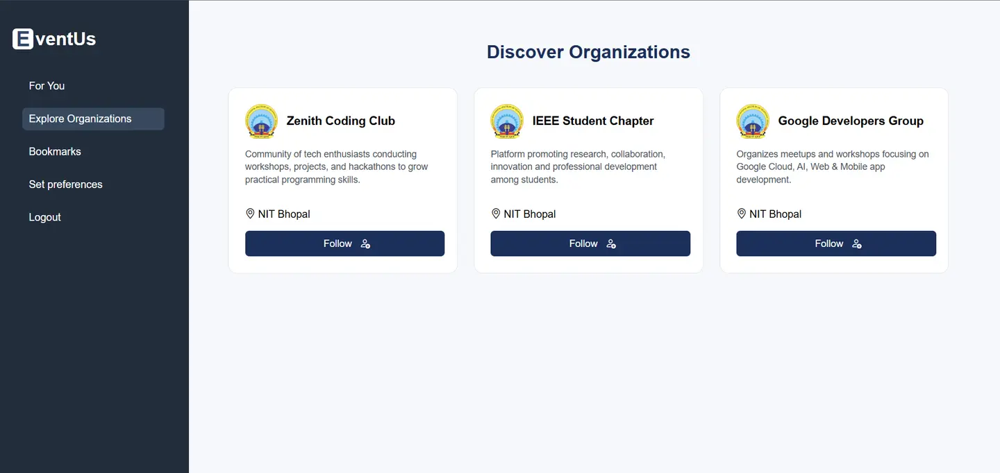
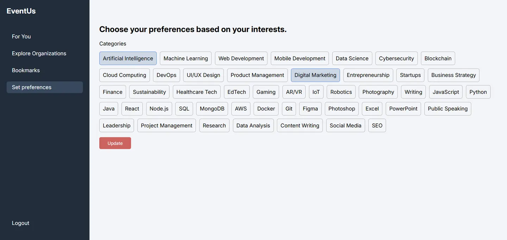
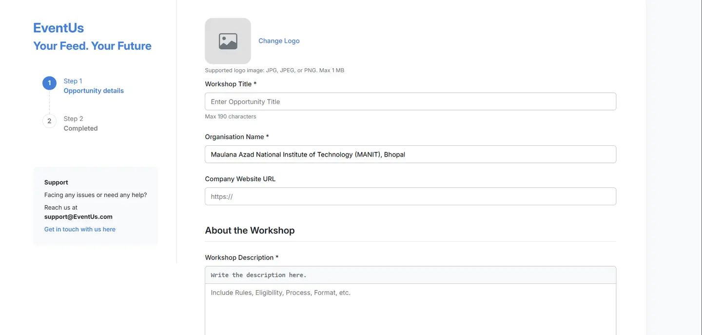

# EventUs - Your Feed. Your Future.

**Discover personalized events powered by AI. Never miss workshops, hackathons, or networking opportunities that match your interests and career goals.**

## Features

- **AI-Powered Recommendations**: Smart event suggestions based on your preferences and interests
- **Personalized Feed**: Curated events tailored to your skills and career goals
- **Organization Discovery**: Find and follow tech organizations like IEEE, Google Developer Groups, and coding clubs
- **Event Management**: Host workshops, hackathons, seminars, and networking events
- **Smart Matching**: Advanced algorithm matches events with your profile using similarity scoring
- **Dual Interface**: Separate portals for users and organizations

## Tech Stack

- **Backend**: Node.js, Express.js
- **Database**: MongoDB with Mongoose ODM
- **AI/ML**: Google Gemini AI, Natural Language Processing
- **Frontend**: EJS templating, CSS3, JavaScript
- **Authentication**: JWT tokens, bcrypt encryption
- **File Upload**: Multer for image handling

## Screenshots

### Landing Page

*AI-powered event discovery with personalized recommendations*

### Event Discovery

*Browse hackathons, workshops, and networking opportunities*

### Organization Explorer

*Discover and follow tech organizations*

### Preference Settings

*Set your interests for personalized recommendations*

### Event Creation

*Easy event hosting for organizations*

## Key Features

### For Users
- **Smart Feed**: AI curates events based on your tech stack and interests
- **Skill Matching**: Events matched to your programming languages and domains
- **Bookmark System**: Save interesting events for later
- **Organization Following**: Stay updated with your favorite tech communities

### For Organizations
- **Event Hosting**: Create hackathons, workshops, seminars, and networking events
- **Audience Targeting**: Reach users with relevant interests
- **Analytics**: Track event engagement and participation


## AI Recommendation System

EventUs uses advanced machine learning algorithms to provide personalized event recommendations:

- **Natural Language Processing**: Analyzes event descriptions and user preferences
- **Similarity Scoring**: Calculates match scores between users and events
- **Google Gemini Integration**: Enhances recommendation accuracy with AI insights
- **Preference Learning**: Continuously improves suggestions based on user interactions

## Project Structure

```
EventUs/
├── models/          # Database schemas
├── views/           # EJS templates
├── public/          # Static assets
├── utils/           # AI and recommendation utilities
├── uploads/         # User uploaded files
├── scripts/         # Data processing scripts
└── app.js          # Main application file
```

## Event Types Supported

- **Hackathons**: Competitive programming events
- **Workshops**: Skill-building sessions
- **Seminars**: Knowledge sharing talks
- **Networking**: Professional meetups
- **Conferences**: Large-scale tech events

## Future Updates

- **Social Networking**: Connect with people of same interests and form event groups, or network with others who have similar interests
- **Calendar Integration**: Integrate with Google Calendar or Outlook so users can add upcoming events directly to their schedule with reminders
